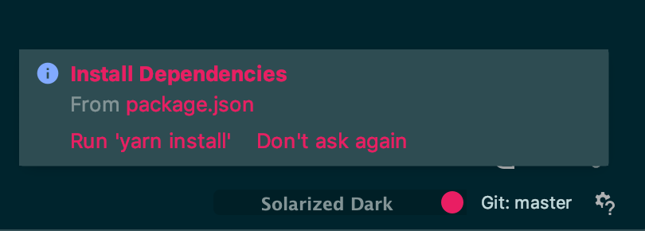

# Boilerplate JavaScript
> A JS boilerplate use at HEPL for DCC.

* * *

**Boilerplate_JS** is an educational project, which will be used for `JS` courses.

**Note:** the school where the course is given, the [HEPL](http://www.provincedeliege.be/hauteecole) from Liège, Belgium, is a french-speaking school. From this point, the instruction will be in french. Sorry.

* * *


Ceci est une version très simplifiée inspirée du célèbre [boilerplate html 5](https://html5boilerplate.com/) adapté au cours de JavaScript.

La compilation des fichiers SCSS et JS se fait à l’aide de [laravel-mix](https://laravel-mix.com/). Les fichiers sources se retrouvent dans le dossier `src`.


## Installation 
1. Installez la dernière version stable de [node](https://nodejs.org/en/download/) sur votre machine idéalement en passant [nvm](https://github.com/nvm-sh/nvm/blob/master/README.md).
1. Installez la dernière version stable de [npm](https://www.npmjs.com/get-npm) sur votre machine.
1. Installez la dernière version stable de [yarn](https://yarnpkg.com/lang/en/docs/install/#mac-stable) sur votre machine.

Vous pouvez vérifier la version de `node` , `npm` et `yarn` avec les commandes suivantes. 

Node : 
```bash
node -v
```
NPM :
```bash
npm -v
```
Yarn :
```bash
yarn -v
```


### Installation des dépendances

#### Jetbrains

Si vous êtes sous jetbrains, cliquez simplement sur le boutton `Run yarn install` après l'ouverture du projet.



#### En ligne de commande

```
yarn install
```

## Utilisation
Afin de provoquer une première compilation des fichiers sources vous devez exécuter la commande :
```
yarn prod
```
la commande :

```
yarn watch
```

Pour compiler automatiquement les fichiers sources à chaque enregistrement de ceux-ci.

Ou  la commande 

```
yarn hot
```
Pour qu'en plus la page soit automatiquement rafraîchie dans le navigateur à chaque enregistrement. ⚠️ Si la commande `yarn hot` ne fonctionne pas dans votre environnement  Windows utlisez uniquement ` yarn watch` et rafraîchissez manuellement votre navigateur.

## ESLint pour une syntaxe plus méthodique

Je vous invite à suivre les instructions proposées par [Wes Bos][https://github.com/wesbos] [ici][https://github.com/wesbos/eslint-config-wesbos]

Rem : Si vous utiliser [PhpStorm](https://www.jetbrains.com/phpstorm/) vous pouvez demander à ce qu’il respecte les règles définit dans le fichier `.eslintrc`, comme cela est décrit [ici](https://www.jetbrains.com/help/idea/eslint.html). Attention, il s’agit d’une configuration spécifique au _projet_ si vous souhaitez en faire une configuration par défaut vous devez vous rendre dans le menu `File`>`Other Settings` > `Preferences for New Projects...`.


